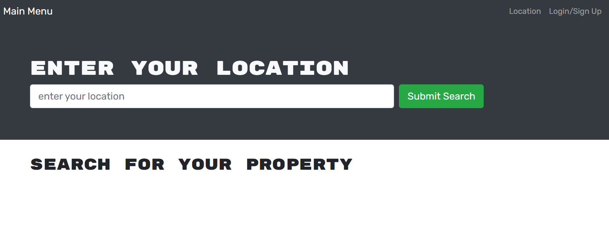

# Summary
The user will be able to search the property for the particular location to invest.

## Table of Contents
- [User Story](#userstory)
- [Functionality](#functionality)
- [Acceptance Criteria](#acceptancecriteria)
- [Technology Used](#technologyused)
- [Screenshot](#screenshot)

## User Story

* AS AN tenant
I WANT to be able to search property to rent.

## Business Context

Tenant who pay their weekly rent can get an opportunity to own the share of that property.

## Functionality

* As a tenant I can search a property for a particular suburb

* I can sign up as a user.

* Login as a user with the sign up email address

## Technology Used

* React for the front end.

* Node.js and Express.js server.

* MongoDB and the Mongoose ODM for the database.

* Heroku (with data).

## Screenshot
